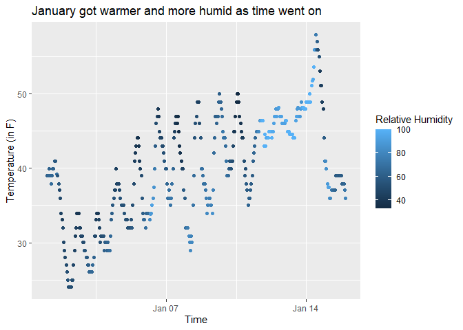

p8105_hw1_geg2145
================
Gustavo Garcia-Franceschini
2023-09-18

# Problem 1

``` r
data("early_january_weather")
weather = early_january_weather
```

This dataset has hourly meterological data for the month of January 2013
for three airports: La Guardia, John F. Kennedy, and Newark Liberty. In
total, this dataset has 358 rows and 15 columns. The `origin` variable
tells us the weather station that made the recording, although for this
subset, all recordings are made from “EWR” (Newark). We also have the
recorded `temperature` and `relative humidity`, along with the `time`
the recording was made (date and hour). The mean temperature across all
the recordings available is 39.582 degrees Fahrenheit.

``` r
ggplot(weather) + 
  geom_point(aes(x= time_hour, y = temp, col= humid)) + 
  labs(x="Time", y="Temperature (in F)", 
       col="Relative Humidity", 
       title="January got warmer and more humid as time went on")
```

<!-- -->

``` r
ggsave("problem1_plot.png")
```

    ## Saving 7 x 5 in image

In the above scatterplot, we see `time` in the x-axis and `temperature`
in the y axis. Although the temperature fluctuates throughout the day
(as we go from day to night, and back to day), we see that overall,
temperature is trending upwards as time goes on. We also see our points
colored by their `relative humidity`, and see most dark points in
earlier dates, with most of the lighter ones in later dates. This
indicates that generally, the days got more humid as January went along.
